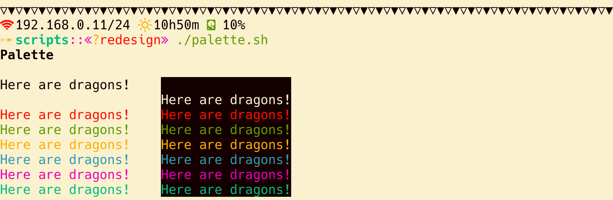

# Tropical Paradise

A lovely colorscheme made for terminals that is fun to play with. It has
versions for day and night that only inverts the background and foreground,
keeping the same palette.

It is available for the applications and style languages I use most.

## Preview

## See Also
  + [`becho`](https://github.com/skippyr/becho) - A terminal utility designed
    to help you treat, style and print text to the standard output.
  + [`river_dreams`](https://github.com/skippyr/river_dreams) - The ZSH theme
    that you have been dreaming for a long time.

## Copyright

Copyright (c) 2023, Sherman Rofeman. MIT License.

