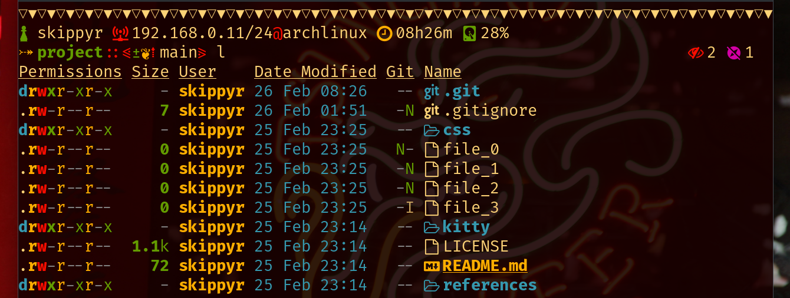
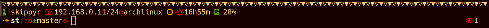

# Tropical Paradise

A colorscheme with a warm palette and light colors. It echos
mystery and rage meanwhile being fun to play with.


## Preview


In the image:
  + the theme for ZSH is [`River Dreams`](https://github.com/skippyr/river_dreams).

## Installation

### CSS/SCSS

  + Copy the desired stylesheets file, `stylesheets/tropical_paradise.css` or
    `stylesheets/tropical_paradise.scss` to your project's repository directory.

  + Include the file in your HTML by using the `link` tag or include it in your
    CSS/SCSS file by using the `@import` rule.


### Kitty

  + Copy the file `kitty/tropical_paradise.conf` to your Kitty configuration
    directory, which is at `~/.config/kitty`.
  + Create the file `~/.config/kitty/kitty.conf` and include the theme you
    copied.

    ```bash
    include tropical_paradise.conf
    ```


### Konsole
  
  + Copy the file `konsole/tropical_paradise.colorscheme` to
    `~/.local/share/konsole`.
  + Select the color scheme in Konsole's configurations.

### St

  + access the file `config.def.h` in the st's repository directory and
    replace the array `colorname` and variables `defaultfg` and `defaultbg`
    with the ones that are in the file `st/tropical_paradise.c`.
  + remove the file `config.h`.
    
    ```bash
    rm -rf config.h
    ```
  + compile and install `st`.

    ```bash
    sudo make clean install
    ```
  
  To be easier to mantain this theme, I prefer not to include a diff file.


### Vim/Neovim (under development)
  + if you are using a plugin manager, simply point to this repository. For
    example, if you are using `Packer`, you can use this line:

    ```vim
    use 'skippyr/tropical_paradise'
    ```
  
  + if you want to manually install this color scheme:
    + if you are using Vim, create the directory `~/.vim/colors`.
    + if you are using Neovim, create the directory `~/.config/nvim/colors`.
    
    Then, copy the file `vim/tropical_paradise.vim` to the directory created.
  
  + apply the color scheme by using the `colorscheme` keyword.

    ```vim
    colorscheme tropical_paradise
    ```


### Wallpapers

I have separated some free wallpapers that goes well with this color scheme at
`wallpapers/wallpapers.md`. You can download them from their source and help
their authors.


## Troubleshooting

This section will talk about common issues I have found when trying to apply Tropical Paradise and how to solve them.


### Bright Bold In St



This issue happens because `st`, by default, uses bright colors when rendering
bold text.

The solution for this issue is to use the patch [`bold is not bright`](https://st.suckless.org/patches/bold-is-not-bright).


## License

Copyright (c) 2023 Sherman Rofeman. MIT License.
