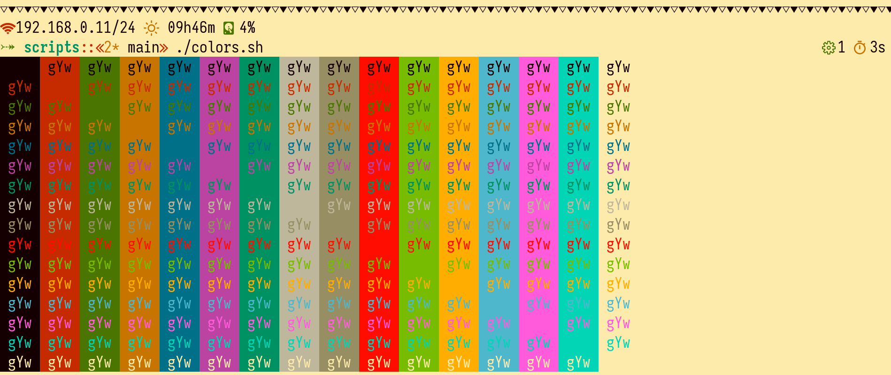
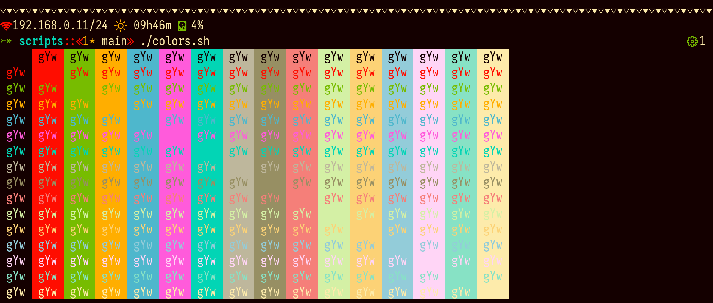

<h1 align="center">🍹Tropical Paradise 🌴</h1>

  

A hard theme with vibrant colors made for the __angels__ of the
_light_ and the __demons__ of the _night_ that are in the search of
their _Tropical Paradise_.

It is available for a wide variety of popular terminal emulators.

## Preview

### Light Color Scheme

### Dark Color Scheme

## Colors
### Light Color Scheme
| Name          | Terminal Value | Value   | Preview                             |
| ------------- | -------------- | ------- | ----------------------------------- |
| Dark Black    | 0              | #140000 |         |
| Light Black   | 8              | #978f63 |   |
| Dark Red      | 1              | #c62b00 |      |
| Light Red     | 9              | #ff0d00 |           |
| Dark Green    | 2              | #4a7500 |    |
| Light Green   | 10             | #77bc00 |         |
| Dark Yellow   | 3              | #c77400 |   |
| Light Yellow  | 11             | #ffae00 |        |
| Dark Blue     | 4              | #007089 |     |
| Light Blue    | 12             | #4eb7cc |          |
| Dark Magenta  | 5              | #bb43a1 |  |
| Light Magenta | 13             | #ff5bdb |       |
| Dark Cyan     | 6              | #009163 |     |
| Light Cyan    | 14             | #02d5b5 |          |
| Dark White    | 7              | #beb79c |         |
| White         | 15             | #fdebab |   |

### Dark Color Scheme
| Name          | Terminal Value | Value   | Preview                              |
| ------------- | -------------- | ------- | ------------------------------------ |
| Dark Black    | 0              | #140000 |          |
| Light Black   | 8              | #978f63 |    |
| Dark Red      | 1              | #ff0d00 |            |
| Light Red     | 9              | #f57f79 |      |
| Dark Green    | 2              | #77bc00 |          |
| Light Green   | 10             | #d4f0a5 |    |
| Dark Yellow   | 3              | #ffae00 |         |
| Light Yellow  | 11             | #fcd276 |   |
| Dark Blue     | 4              | #4eb7cc |           |
| Light Blue    | 12             | #93ccd9 |     |
| Dark Magenta  | 5              | #ff5bdb |        |
| Light Magenta | 13             | #ffd5f6 |  |
| Dark Cyan     | 6              | #02d5b5 |           |
| Light Cyan    | 14             | #87e2c5 |     |
| Dark White    | 7              | #beb79c |          |
| White         | 15             | #fdebab |    |

## Installation
Tropical Paradise is available for some applications and installation
instructions are separated in directories in this repository. Simply access
a directory of an application you want to use and view the `INSTALLATION.md`
file.

## See Also
Check out a list of other projects that are related to this one.

  + [`Becho`](https://github.com/skippyr/becho) - A terminal utility designed
    to help you treat, style and print text to the standard output.
  + [`River Dreams`](https://github.com/skippyr/river_dreams) - The ZSH theme
    that developers have been dreaming for a long time.
  + [`Iosevka`](https://github.com/be5invis/Iosevka) - a versatile coding
    font that can imitate other popular fonts by using stylistic sets.

## Issues, Enhancements And Questions
If you have found an issue while using this software or have an idea to
improve it, feel free to use the issues tab on its page on GitHub.

Questions can be made in the same way, but it would be better if you use
the Discussions tab instead.

## Copyright
Copyright (c) 2023, Sherman Rofeman. MIT License.
