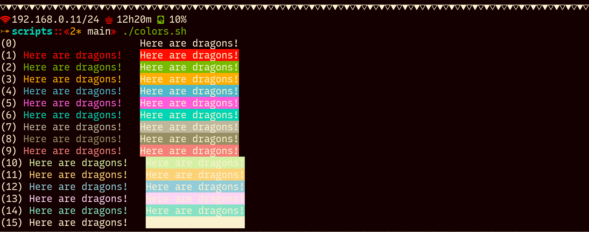
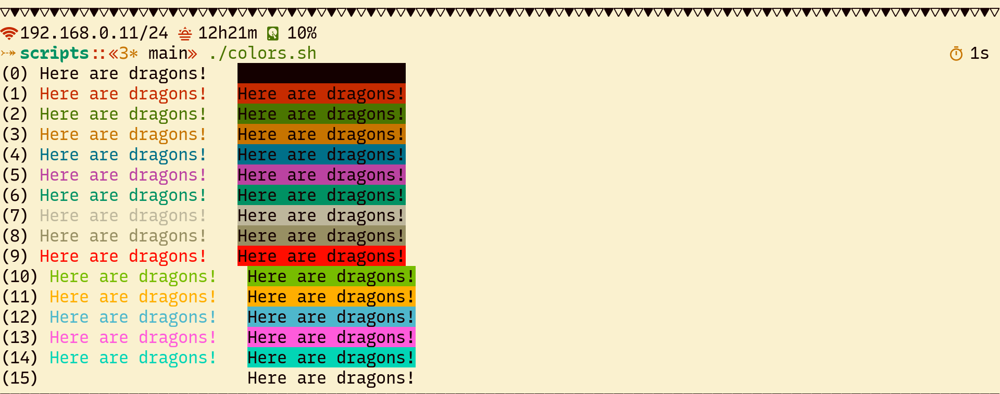

# Tropical Paradise

A useful color scheme with vibrant colors made for the __angels__ of the
_light_ and the __demons__ of the _night_ that are in the search of
their _Tropical Paradise_.

It is available for the applications and style languages I use most.


## Preview


### Dark Palette




### Light Palette



There is the script `scripts/colors.sh` that you can use to review the
palette of the themes.


## Installation


### Kitty

  + copy the color scheme files from `kitty` to `~/.config/kitty/themes`.
  + include the desired color scheme in `~/.config/kitty/kitty.conf`:

    For dark palette:
    ```
    include themes/tropical_paradise_dark.conf
    ```

    For light palette:
    ```
    include themes/tropical_paradise_light.conf
    ```
  + refresh your Kitty session.

### St

  + replace the theme definitions that are in your `config.def.h` by one of
    that are in `st`.
  + remove the file `config.h` if it exists.
  + recompile the software using `sudo make clean install`.

  Also, consider to apply the patch [`bold is not bright`](https://st.suckless.org/patches/bold-is-not-bright).

## See Also

  + [`Becho`](https://github.com/skippyr/becho) - A terminal utility designed
    to help you treat, style and print text to the standard output.
  + [`River Dreams`](https://github.com/skippyr/river_dreams) - The ZSH theme
    that developers have been dreaming for a long time.
  + [`Iosevka`](https://github.com/be5invis/Iosevka) - a versatile coding
    font that can imitate other popular fonts by using stylistic sets.


## Issues And Enhancements

If you have found an issue while using this software, you can report it in
the issues tab of its page on GitHub. Enhacements can also be asked in the
same way.


## Copyright

Copyright (c) 2023, Sherman Rofeman. MIT License.

